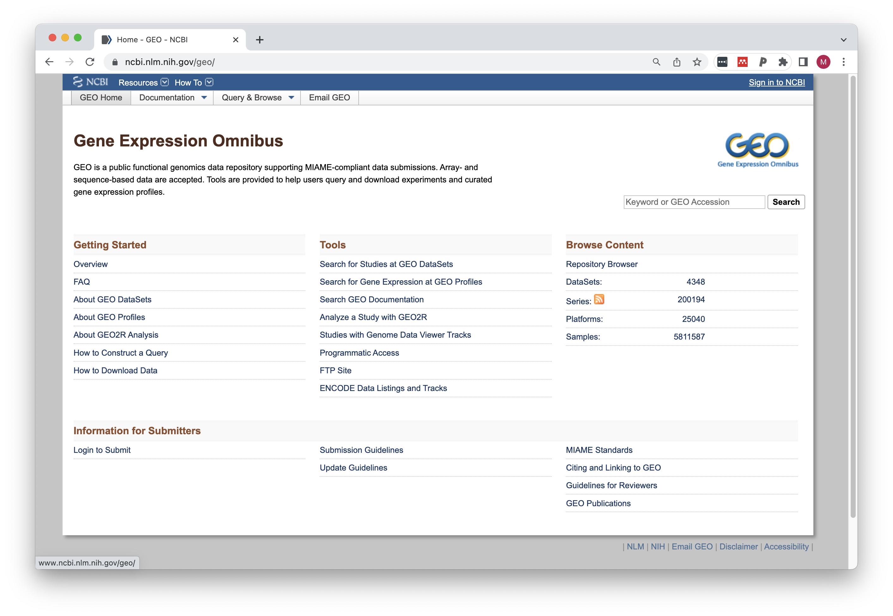
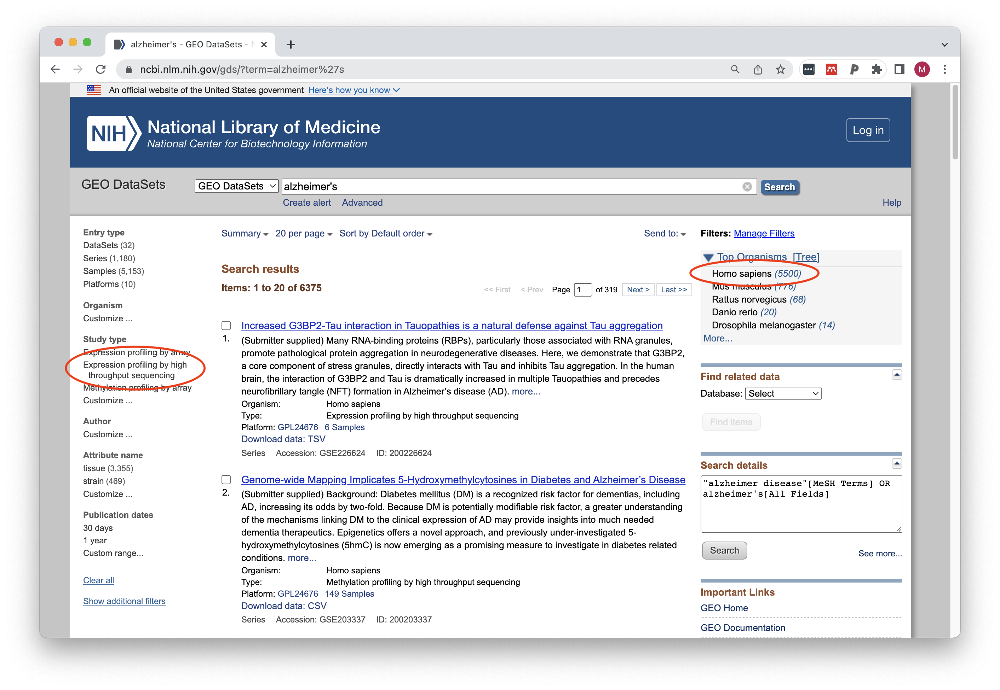
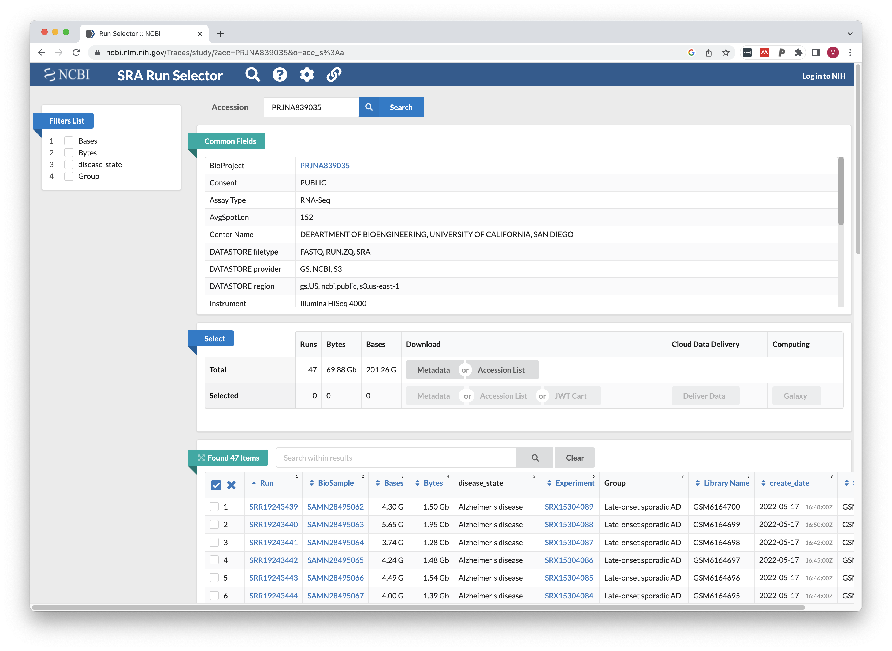

# RNA-seq data practical

We are going to use NCBI Gene Expression Omnibus to identify possible datasets of interest.

Go to the [GEO homepage](https://www.ncbi.nlm.nih.gov/geo/) and search for "alzheimer's".



We have a lot of results! But we can rule out many of them without even reading through the descriptions. Filter the results by organism and by study type:



We should see 227 results (as of May 22, 2023).

1. Are all the search results useful for our question?
2. Do you notice any similaries among search results?

We are going to look at one study in-depth to see if we can access the data.

Select the study named **"Transcriptomic profiling of sporadic Alzheimer’s disease patients"** (or go to this link: [GSE203206](https://www.ncbi.nlm.nih.gov/geo/query/acc.cgi?acc=GSE203206))

Click on the SRA Run Selector link on the bottom of the page.



Normally we can download the run selector table and this file can be directly used in one of our snakemake pipelines. However, for this lab we are just going to download data from one run using the sra-toolkit.

First, activate the conda environment to load the software:

```bash
conda activate teabiscuit
```

The prefetch command will download an SRA file from the NCBI Sequence Read Repository in a binary format:

```bash
prefetch SRR19243439
```

We can use the `fastq-dump` utility to convert the data in the SRA file to FASTQ format. Basic usage for `fastq-dump` is:

```
Usage:
  fastq-dump [options] <path> [<path>...]
  fastq-dump [options] <accession>

INPUT
  -A|--accession <accession>       Replaces accession derived from <path> in
                                   filename(s) and deflines (only for single
                                   table dump)
  --table <table-name>             Table name within cSRA object, default is
                                   "SEQUENCE"
```

The split-3 option is important if you have paired-end sequencing, or if you don't know. Because of the way SRA files store reads, if you do not use this option and you actually have paired-end sequences, the two mates will be concatenated into a single read (which is an incorrect representation when they overlap or there is an insert between the reads).

```
--split-3                          3-way splitting for mate-pairs. For each
                                   spot, if there are two biological reads
                                   satisfying filter conditions, the first is
                                   placed in the `*_1.fastq` file, and the
                                   second is placed in the `*_2.fastq` file. If
                                   there is only one biological read
                                   satisfying the filter conditions, it is
                                   placed in the `*.fastq` file.All other
                                   reads in the spot are ignored.
```

I recommend using these just for formatting the FASTQ files:

```
-F|--origfmt                       Defline contains only original sequence name
--defline-qual <fmt>               Defline format specification for quality.
```

Extract fastq files using:

```bash
fastq-dump -F --split-3 --defline-qual '+' SRR19243439/SRR19243439.sra
```

