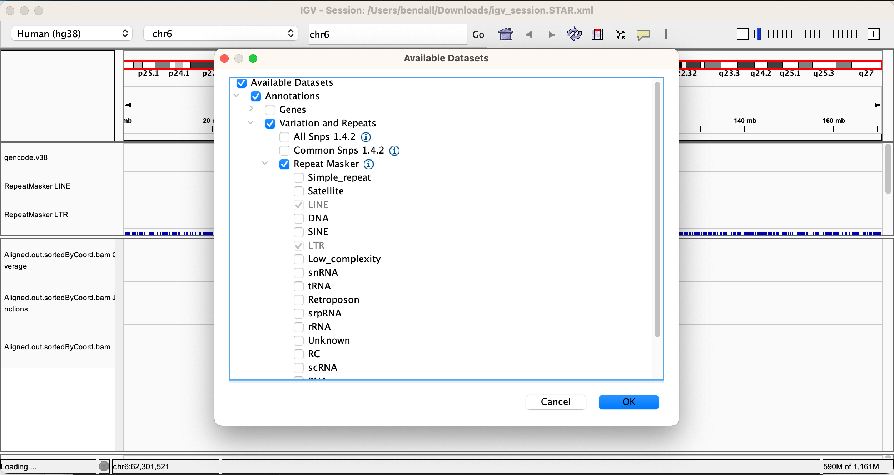

# Telescope

##### Before starting today, you may need to:

Sync your copy of the teabiscuit repository using `git`

```bash
cd ~/teabiscuit
git pull
```

Activate your teabiscuit environment that we made on Monday:

```bash
conda activate teabiscuit
```

## Alignment

### SAM/BAM files

The [SAM/BAM format](https://samtools.github.io/hts-specs/SAMv1.pdf) is a standardized file format for representing sequence alignments to a reference genome. It is able to include all the data needed to describe an alignment and the original input FASTQ files can be reconstructed (lossless). SAM files are tab-delimited text files and can be viewed with common command-line tools. BAM files are compressed (zipped) binary files that may be sorted and indexed for fast retrieval of alignments overlapping a genomic region.

The [samtools](http://www.htslib.org/) package is useful for working with SAM/BAM format files.

SAM/BAM files can also be used to store unaligned data (uBAMs)

CRAM files are able to achieve better compression than BAM files by storing reads aligned to a reference sequence and only storing the bases that differ from the reference. One may also opt for controlled loss of data for even better compression, i.e. eliminating read names or qualities.


#### Viewing BAM files

Activate teabiscuit environment:


```bash
samtools view ENCSR693KOP/Aligned.out.bam | less -S
```

This python code will print out alignments for all the reads with 500 alignments:

```python
import pysam
af = pysam.AlignmentFile('ENCSR693KOP/Aligned.out.bam')
iter = af.fetch(until_eof=True)
for aseg in iter:
    if aseg.has_tag('NH') and aseg.get_tag('NH')==500:
        print(aseg.to_string())
```

## Visualizing alignments

Tools for visualizing alignments:

+ [Intergrative Genomics Viewer (IGV)](https://software.broadinstitute.org/software/igv/)
+ [UCSC Genome Browser](https://genome.ucsc.edu/)

### Download and install IGV

Go to [https://software.broadinstitute.org/software/igv/download](https://software.broadinstitute.org/software/igv/download)

Follow the directions for your OS. I recommend the "Java included" versions unless you have a good reason not to.

### Choose Genome

We are going to be viewing annotations and alignments for hg38


### Load data tracks

> **tl;dr** Download this IGV session file locally [igv_session.STAR.xml](./igv_session.STAR.xml) and open it using "File > Open Session..."

Data tracks are loaded using the "File" menu. Data can be loaded from a local file (on your computer) using "File > Load from File..."; from a URL ("Load from URL...") or from a public server ("Load from server...").

We are going to load from a URL so that you don't have to download all the files locally. The tracks we will load are:

##### GENCODE annotation v38

URL: `http://nixonlab-cluster.hopto.org/efs/projects/teabiscuit.git/02-telescope/gencode.v38/gencode.v38.ALL.annotation.gtf.gz`
Index: `http://nixonlab-cluster.hopto.org/efs/projects/teabiscuit.git/02-telescope/gencode.v38/gencode.v38.ALL.annotation.gtf.gz.tbi`

##### Telescope annotation

URL: `http://nixonlab-cluster.hopto.org/efs/projects/teabiscuit.git/02-telescope/retro.hg38.v1.gtf`

##### Alignment (BAM file)

URL: `http://nixonlab-cluster.hopto.org/efs/projects/teabiscuit.git/02-telescope/ENCSR693KOP/Aligned.out.sortedByCoord.bam.bai`
Index: `http://nixonlab-cluster.hopto.org/efs/projects/teabiscuit.git/02-telescope/ENCSR693KOP/Aligned.out.sortedByCoord.bam`

##### RepeatMasker tracks

Go to "File > Load From server"
Navigate the nested structure with the drop-downs




